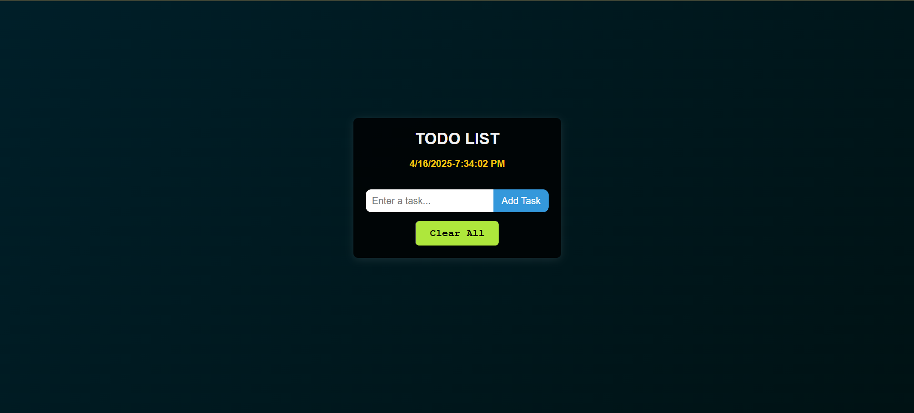

# 📝 React Todo App

A minimal and clean Todo List application built with **React + Vite**, powered by **Bun** for blazing-fast performance. Easily add, complete, and manage daily tasks with a live clock display.



## 🚀 Features

- ✅ Add and delete tasks  
- ✅ Mark tasks as completed  
- 🧹 Clear all tasks  
- 🕒 Real-time date and time  
- 💻 Simple, responsive UI  

## ⚙️ Tech Stack

- [React](https://react.dev/)
- [Vite](https://vitejs.dev/)
- [Bun](https://bun.sh/)
- [React Icons](https://react-icons.github.io/react-icons/)
- Optional: Tailwind CSS / Vanilla CSS

## 📦 Getting Started (with Bun)

```bash
bun install
bun run dev
